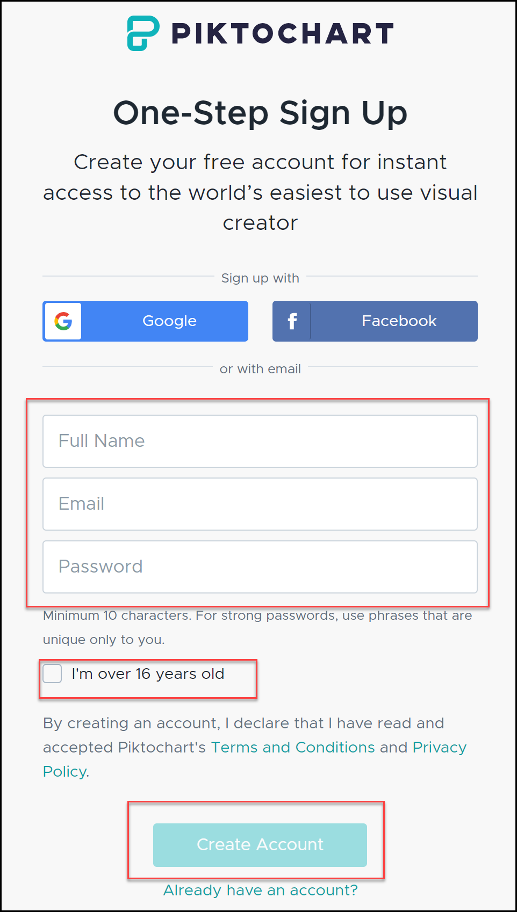

# How to create visual materials with Piktochart

- [How to create visual materials with Piktochart](#how-to-create-visual-materials-with-piktochart)
  - [Introduction](#introduction)
    - [What is piktochart?](#what-is-piktochart)
    - [How to sign in?](#how-to-sign-in)
  - [User interface](#user-interface)
    - [Menu](#menu)
    - [Workspace](#workspace)
    - [Settings](#settings)
  - [Quickstart guide](#quickstart-guide)
  - [Glossary](#glossary)

## Introduction

### What is piktochart?

Piktochart is a web-based graphic design tool. It allows you to easily create visuals, including infographics, reports, presentations, posters, flyers, and social media graphics, using customizable templates.

### How to sign in?

To sign in, you need a Piktochart account first:

1. Go to [Piktochart page](https://piktochart.com/).
2. Select **Sign in** button in the upper right corner.
   
3. You can sign in using your **Google** or **Facebook** account or create Piktochart account using your email address.
4. 

## User interface

Once you sign in, it is time to familiarize yourself with the user interface.

### Menu

On the left side you will find easy to use Menu with **Create new** button. Click the button and decide what you like to create.

Below the button you can also find all available formats:
* **Infographics**
* **Presentations**
* **Posters**
* **Reports**
* **Flyers**
* **Social Media**

You can also create your own custom sizes.

You can find here also **Saved Templates** and **Inspire me** section.

### Workspace

In the central section you see your current workspace. Every visual you create on Piktochart takes place in a workspace. It's where you store your visuals and organize information — as just one person or collaborate as a team. Each account will have a minimum of one workspace.

### Settings

In the navigation bar at the top right corner you will find **Settings** icon and **Switch Workspace** option.

* **Switch Workspace** allows you to switch to other workspaces if you have more than one workspace.
* For each workspace, you have access to the **Settings & Members** page for the workspace.
* You can change setiings in a **specific workspace** or you can make **Personal Settings** which apply to all of your Piktochart workspaces.

## Quickstart guide

With Piktochart's comprehensive interface, tools, and features, you can be an infographic-making genius in no time. Try to create your firts visual in 6 Steps:

1. Select the format
   
   Select the format you want to create in the left side menu.
2. Find the Right Template

Once you click on the chosen format you 
1. Select a Template
2. Insert Graphics
3. Visualize your Data
4. Share your Visual

## Glossary

* **Dashboard** is a place when you can find all your work. From here, you may view and manage all your saved visuals.
* **Infographics** are perfect for viewing on the web. They are visual representations of information. They can tell a story in a colorful, beautiful way.
* **Presentations** are using for introducing a topic to an audience, typically with the aid of projected images as slides.
* **Posters** are single pages to convey information in an attention-grabbing visual! They are slightly different from a Flyer template.
* **Reports** are used to display insightful data and results for your business, a campaign, or an event at a particular time period.
* **Flyers** are flexible designs that can be one or two pages. They also can hold a lot more text than a Poster format template.
* **Social Media** ready to use templates with the different social media format (Facebook, Instagram etc.) which you can edit to fit your brand and add to your respective social media profiles.
