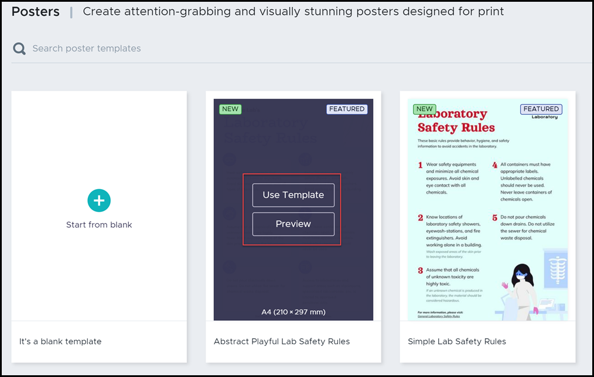
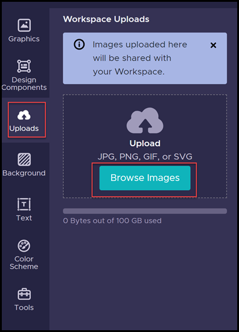

# How to create visual materials with Piktochart

- [How to create visual materials with Piktochart](#how-to-create-visual-materials-with-piktochart)
  - [Introduction](#introduction)
    - [What is piktochart?](#what-is-piktochart)
    - [How to sign in?](#how-to-sign-in)
  - [User interface](#user-interface)
    - [Menu](#menu)
    - [Workspace](#workspace)
    - [Settings](#settings)
  - [Quickstart guide](#quickstart-guide)
    - [1. Select the format](#1-select-the-format)
    - [2. Find the Right Template](#2-find-the-right-template)
    - [3. Select a Template](#3-select-a-template)
    - [4. Insert Graphics](#4-insert-graphics)
    - [5. Visualize your Data](#5-visualize-your-data)
    - [6. Share your Visual](#6-share-your-visual)
  - [Glossary](#glossary)

## Introduction

### What is piktochart?

Piktochart is a web-based graphic design tool. It allows you to easily create visuals, including infographics, reports, presentations, posters, flyers, and social media graphics, using customizable templates.

### How to sign in?

To sign in, you need a Piktochart account first:

1. Go to [Piktochart page](https://piktochart.com/).
2. Select **Sign in** button in the upper right corner.
   
3. You can sign in using your **Google** or **Facebook** account or create Piktochart account using your email address.
4. If you choose second option enter your **Full name**, **Email**, **Password**, and click **Create Account**.
   
5. A message with a confirmation link will be sent to your email address.
6. Sign in into your email account and confirm your email address.
7. Once done, you can login into your piktochart account.
   
   
8. After logging in for the first time provide some information about yourself and click **Submit**.
   
   
9.  Choose topics you are interested in or skip this step.
    
10. You successfully sign in! You can start creating your first **Visual**.
    

## User interface

Once you sign in, it is time to familiarize yourself with the user interface.

### Menu

On the left side you will find easy to use Menu with **Create new** button. Click the button and decide what you like to create.

Below the button you can also find all available formats:
* **Infographics**
* **Presentations**
* **Posters**
* **Reports**
* **Flyers**
* **Social Media**

You can also create your own custom sizes.

You can find here also **Saved Templates** and **Inspire me** section.

### Workspace

In the central section you see your current workspace. Every visual you create on Piktochart takes place in a workspace. It's where you store your visuals and organize information — as just one person or collaborate as a team. Each account will have a minimum of one workspace.

### Settings

In the navigation bar at the top right corner you will find **Settings** icon and **Switch Workspace** option.

* **Switch Workspace** allows you to switch to other workspaces if you have more than one workspace.
* For each workspace, you have access to the **Settings & Members** page for the workspace.
* You can change setiings in a **specific workspace** or you can make **Personal Settings** which apply to all of your Piktochart workspaces.

## Quickstart guide

With Piktochart's comprehensive interface, tools, and features, you can be an visual-making genius in no time. Try to create your first visual in a few simple steps:

### 1. Select the format

   Select the format you want to create in the left side menu.

   

### 2. Find the Right Template

* Once you click on the chosen format you can go through pre-designed templates ready to use any time.

* If you know the name of the theme you are looking for, you can use the search bar.
* You can also filter through themes of similar topics to look for more template options that relate with what you were looking for.

### 3. Select a Template

* You can first **Preview** the template to make sure of your choice. Once you've decided on your template, click **Use Template** to load the selected template.
  
* In the **Editor**, start by making edits to text by double-clicking the text box and insert your content.
  

### 4. Insert Graphics

* There are thousands of icons and images available in our **Graphics libraries > Shapes & Icons**.
  
* Use the search tool and insert keywords to narrow down further what you're looking for. Just click or drag-and-drop the graphics you need from the menu to your canvas.
* You can also customize how your graphics look by changing the colors, resizing and rotating them.
  
* You can also Upload our own photos, icons and graphics using the **Uploads** tab.
  

### 5. Visualize your Data

* There are tons of tool options to create charts and maps that can be customized to visualize your data.
* A popup will appear from which you can choose the best chart style for your data, coupled with a spreadsheet to input your data.
  

### 6. Share your Visual

* You can download your work in PNG or PDF format as well as in the PowerPoint format
  
* You can also share it by email, or share your infographic directly on social media.
  
* View your infographic on the output page by following the provided URL when you publish to the web for public view. Once you have shared it, you and your audience can enjoy your Piktochart in **Presentation Mode**.

## Glossary

* **Dashboard** is a place when you can find all your work. From here, you may view and manage all your saved visuals.
* **Infographics** are perfect for viewing on the web. They are visual representations of information. They can tell a story in a colorful, beautiful way.
* **Presentations** are using for introducing a topic to an audience, typically with the aid of projected images as slides.
* **Posters** are single pages to convey information in an attention-grabbing visual! They are slightly different from a Flyer template.
* **Reports** are used to display insightful data and results for your business, a campaign, or an event at a particular time period.
* **Flyers** are flexible designs that can be one or two pages. They also can hold a lot more text than a Poster format template.
* **Social Media** ready to use templates with the different social media format (Facebook, Instagram etc.) which you can edit to fit your brand and add to your respective social media profiles.
